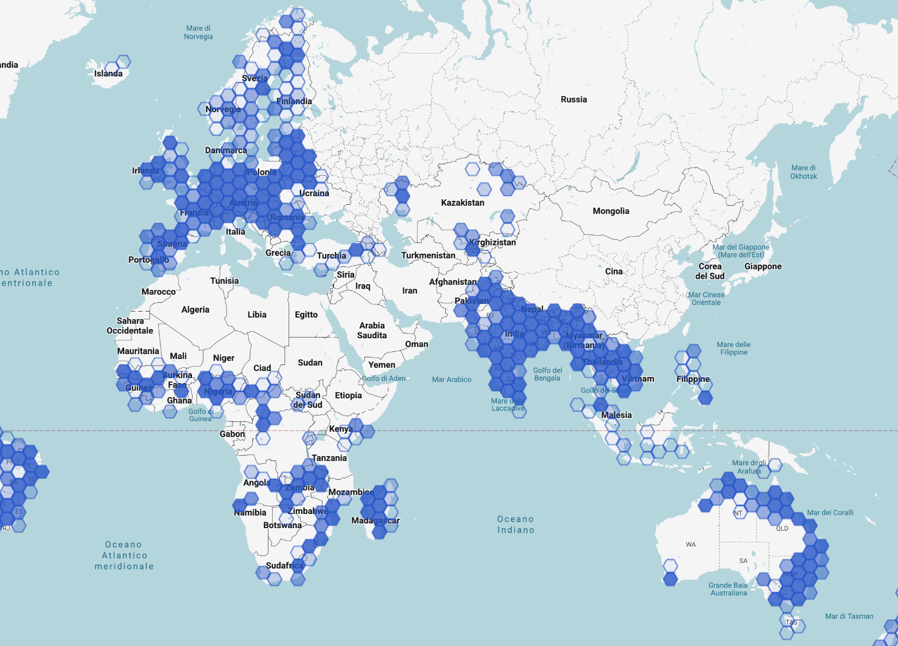
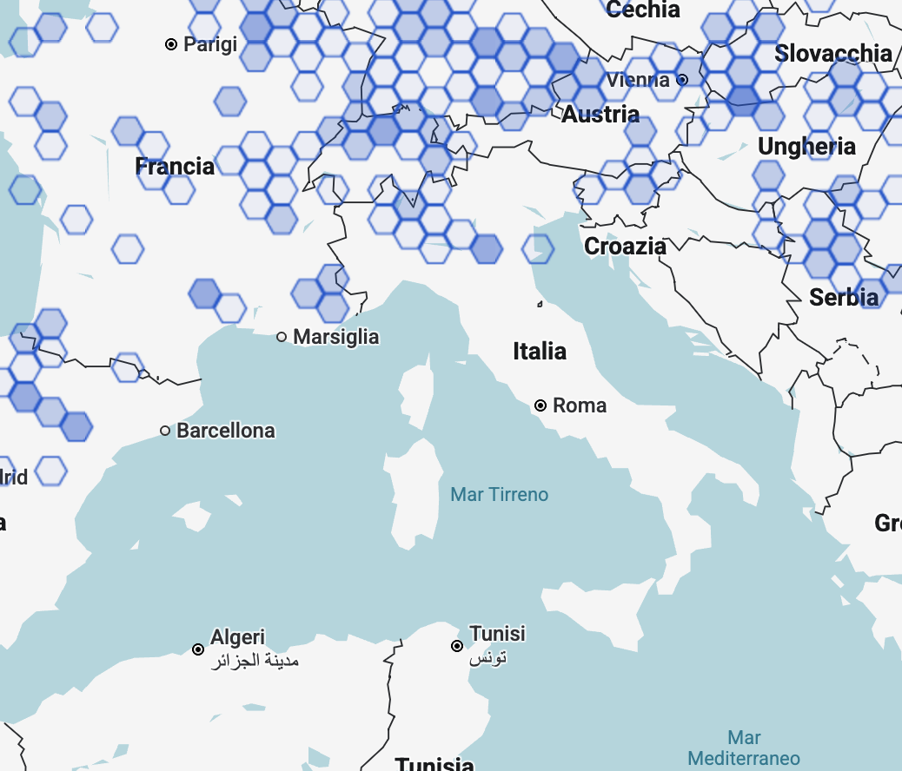
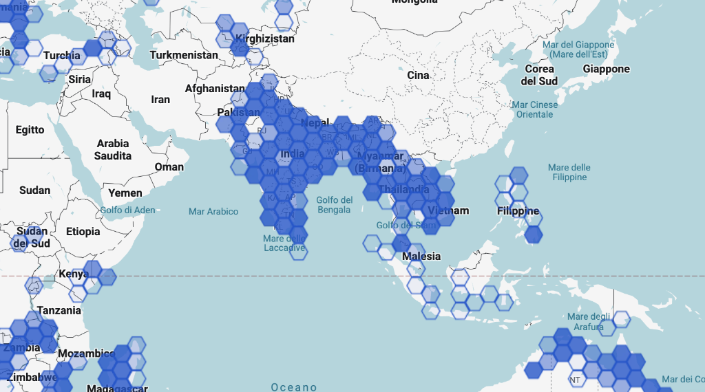
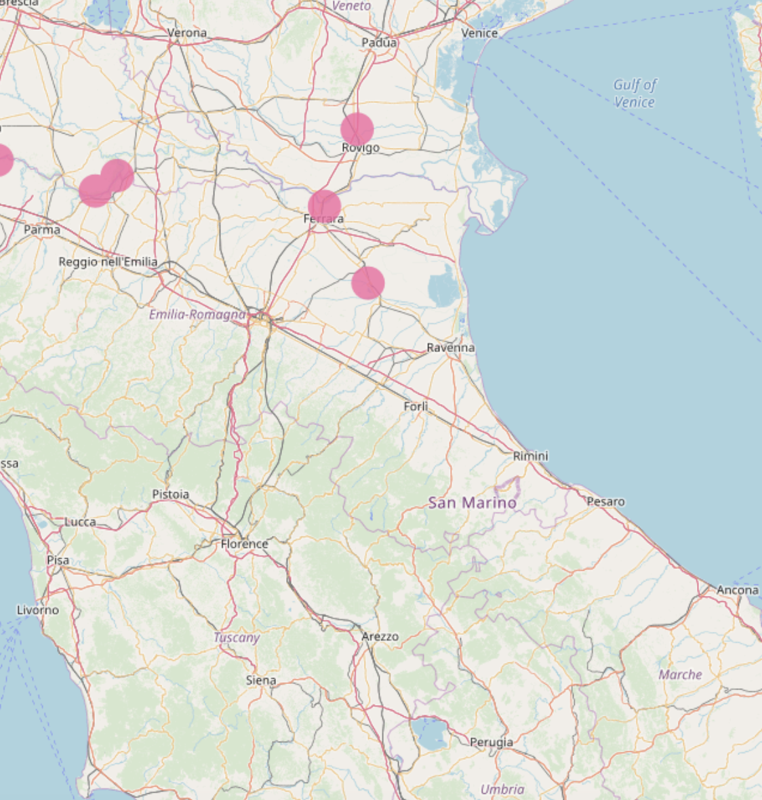

# Floods4castIT

## Allertamento calibrato in due fasi per alluvioni in Italia
Avvio su Emilia-Romagna, con successiva valutazione di estensione alla Toscana.

🚧 **REPO IN COSTRUZIONE** 🚧

Proposta progettuale in fase di impostazione e valutazione. Nessun modello è ancora
implementato. Il documento descrive il flusso logico proposto, tuttora in valutazione,
e le scelte metodologiche di dettaglio sono parte del lavoro di tesi e non ancora
definite. Il primo contenuto analizzato è l'esempio esplorativo sui dati della Fase 1 in
`notebooks/01_processing_eda_fase1.ipynb`.

---

## Indice

1. [Contesto e obiettivo](#1-contesto-e-obiettivo)
   - 1.1 [Disponibilità dei dati](#11-disponibilità-dei-dati)
3. [Architettura della proposta](#2-architettura-della-proposta)
4. [Fase 1: dal dato puntuale alla valutazione lungo il fiume](#3-fase-1--dal-dato-puntuale-alla-valutazione-lungo-il-fiume)
   - 3.1 [Struttura del problema](#31-struttura-del-problema)
   - 3.2 [Impostazioni possibili](#32-impostazioni-possibili-in-bozza-e-solo-alcune-potenziali-idee)
   - 3.3 [Dati in ingresso](#33-dati-in-ingresso)
   - 3.4 [Orizzonte utile](#34-orizzonte-utile)
   - 3.5 [Soglie nei punti non strumentati](#35-soglie-nei-punti-non-strumentati-da-valutare-complesso-ma-utile)
   - 3.6 [Qualità del dato idrometrico](#36-qualità-del-dato-idrometrico)
   - 3.7 [Output della Fase 1](#37-output-della-fase-1)
4. [Fase 2: dalla stima di livello all'area impattata](#4-fase-2-dalla-stima-di-livello-allarea-impattata)
   - 4.1 [Impostazione](#41-impostazione)
   - 4.2 [Stima di partenza e correzione appresa](#42-stima-di-partenza-e-correzione-appresa)
   - 4.3 [Ingresso dalla Fase 1 e degradabilità](#43-ingresso-dalla-fase-1-e-degradabilità)
   - 4.4 [Etichette e qualità del dato satellitare](#44-etichette-e-qualità-del-dato-satellitare)
   - 4.5 [Output della Fase 2](#45-output-della-fase-2)
5. [Quantificazione dell'incertezza](#5-quantificazione-dellincertezza)
6. [Output complessivi e matrice opzionale](#6-output-complessivi-e-matrice-opzionale)
7. [Dati](#7-dati)
8. [Roadmap](#8-roadmap)
9. [Confronti e valutazioni](#9-confronti-e-valutazioni)

---

## 1. Contesto e obiettivo

Un idrometro misura un punto, un'allerta riguarda una zona e la prposta progettuale si inserisce proprio in queste specifiche stime e nella loro combinazione.

L'obiettivo si articola su due fasi.

**Fase 1.** Stimare il livello nei punti di rilevazione e possibilmente ache lungo l'intero fiume, anche nei tratti fra un
idrometro e l'altro, identificando il livello idrometrico e dove verranno superate le soglie di criticità, con
valutazione basata sul solo livello idrometrico. Si parte dai soli dati degli idrometri:
per l'Emilia-Romagna circa 300 stazioni, con serie a 15 e 30 minuti e profondità storica
variabile fra i 15 e i 25 anni.

**Fase 2.** Tradurre il profilo di livello nell'area che verrà presumibilmente
interessata dall'alluvione, sfruttando dati satellitari.

In entrambe le fasi, oltre al valore in output si mira a fornire una quantificazione
dell'incertezza, così da ottenere un risultato finale corredato da una misura di
confidenza, sfruttando framework come Conformal Prediction.

### 1.1 Disponibilità dei dati
Per la fase 1, da [dext3r (dati per l'Emilia Romagna)](https://simc.arpae.it/dext3r/) abbiamo quasi 300 stazioni di rilevazione del livello idrometrico con dati da 15/20 anni con alcune stazioni con dati anche fino a 25 anni. Nell'esempio di valutazione per la disponibilità dei dati si vede come già una singola stazione fornisca 500k rilevazioni (dati di un ordine i grandezza superiore a quelli usati da alcuni studi disponibili sul tema).

---

## 2. Architettura della proposta

Le due fasi formano una catena. La Fase 1 produce un profilo di livello lungo ll fiume,
che la Fase 2 utilizza come ingresso principale.

```
FASE 1 — idrometri
      │
      ├──► allerta preliminare per punto d'interesse
      │
      ▼
profilo di livello lungo il fiume
      │
      ▼
FASE 2 — satellite e rilevazioni per dettagli su terreno
      │
      ▼
area potenzialmente interessata
      │
      ▼ (opzionale)
matrice di traduzione per gestore
```

La Fase 1 produce un output utilizzabile per conto proprio, disponibile prima e
indipendentemente dalla Fase 2. La matrice finale è un livello opzionale e non
vincolante.

---

## 3. Fase 1 — dal dato puntuale alla valutazione lungo il fiume

### 3.1 Struttura del problema

Il problema ha tre caratteristiche:

- la **topologia**: le sezioni del fiume, ordinate da monte a
valle, dove l'informazione si propaga con un ritardo legato al tempo di
transito.

- il **vincolo bilaterale**: un punto di interesse compreso fra due stazioni
è racchiuso fra due misure. L'onda che vi transita è stata osservata a monte e sarà
osservata a valle.

- la **geometria del tratto**, che modula la propagazione: distanza, dislivello,
pendenza, larghezza dell'alveo, presenza di confluenze o casse di espansione.

I punti da stimare sono gli idrometri stessi ma anchee i punti che interessano a
chi deve decidere (zone popolate o gestori di infrastrutture), quali attraversamenti, nuclei abitati, prese e sottopassi, che
potrebbero non coincidere con una stazione di misura.

### 3.2 Impostazioni possibili (in bozza e solo alcune potenziali idee)

Diverse impostazioni possono catturare le caratteristiche descritte sopra. La scelta: sul confronto con le baseline è uno dei punti importanti della fase 1.
-  modelli per punto su feature costruite dalle stazioni vicine, con ritardi calibrati (potenziale nucleo iniziale)
- interpolazione del profilo lungo la coordinata curvilinea del fiume, con vincoli di plausibilità idraulica (da valutare se inserire tematiche vincolate al mondo idraulico)
- valutare reti su grafo con archi informati dalla geometria per sfruttare esplicitamente la topologia del territorio.
- modelli di propagazione a parametri appresi, di ispirazione idraulica o modelli sequenziali multi-stazione con rappresentazione dei nodi

L'elenco non è esaustivo e non implica una preferenza già assunta. Si mira a
identificare un livello previsto su più orizzonti temporali, potenzialmente in ogni
sezione del fiume in analisi ma partendo in primis dalle stazioni disponibili.

### 3.3 Dati in ingresso

L'idea è di **non** usare i dati di precipitazione, né osservati né previsti. Eventualmente,
se necessario, si valuterà l'uso di dati satellitari a corredo, ma limitatamente alla potenziale possibilità di
ricostruzione delle soglie idrometriche statiche nelle sezioni non strumentate.

La scelta ha una motivazione strutturale. Un punto compreso fra due idrometri non è un
bacino privo di misure, dove la precipitazione diventerebbe necessariamente
l'informazione dominante. L'onda che vi transita è stata osservata a monte e sarà
osservata a valle, quindi si tratta di un problema al contorno. Le stazioni di monte portano la forzante già integrata dal bacino.

### 3.4 Orizzonte utile

L'orizzonte previsionale utile non è arbitrario, ma potrebbe essere potenzialmente limitato dal tempo di transito dell'onda dalle stazioni di monte (almeno fisicamente è così). Mentre l'orizzonte predittivo è d valutare con i dati a disposizione per prevedere con x ore di anticipo e si mira a stimarlo relazionando gli eventi storici edi dati a dispozione.

### 3.5 Soglie nei punti non strumentati (da valutare, complesso ma utile)

Nei punti non strumentati le soglie ufficiali non esistono, e serve valutare come
ricostruirle usando le sezioni adiacenti o altre informazioni, eventualmente di origine
satellitare. Le soglie così ottenute sono stime e vanno presentate come tali, distinte
dai codici colore ufficiali.

### 3.6 Qualità del dato idrometrico

Le serie idrometriche presentano lacune, valori bloccati, derive dello zero e salti. Il problema principale è che un picco di
piena e un sensore che si "rompe" si somigliano molto: entrambi producono variazioni
rapide e valori fuori scala, e una procedura di pulizia semplicistica rischia di eliminare
proprio gli eventi che interessano.

Sarà necessario studiare in primo luogo queste dinamiche, affiancando metodi data-driven
a vincoli di plausibilità fisica sulla velocità di variazione, coerenti con il tempo di
risposta della sezione. Una leva utile è la coerenza fra stazioni dello stessa fiume:
un'onda reale si manifesta anche a monte e a valle con il ritardo atteso, mentre un
guasto resta locale (potenziale logica da implementare ma no unica).

Va tenuto presente un vincolo metodologico: se l'insieme usato per la calibrazione delle
garanzie contiene valori ricostruiti, la garanzia si riferisce in parte a dati sintetici e anche questo è un tema da valutare negli impatti metodologici e di qualità.

### 3.7 Output della Fase 1

Un'allerta preliminare per punto d'interesse, con finestra temporale e quantificazione
dell'incertezza, disponibile prima e indipendentemente dalla Fase 2.

---

## 4. Fase 2: dalla stima di livello all'area impattata

### 4.1 Impostazione

In questa fase la stima parte invece dal livello previsto insieme ai dati saptellitari ma no per prevedere il livello ma per stimare le aree potenzialmente impattate dal'evento, quindi: **Tradurre il profilo di livello
nell'area che verrà presumibilmente interessata dall'acqua (sfruttando dati satellitari)**

Si mira a valutare cosa è avvenuto in eventi realmente osservati, senza dipendere da un
modello idraulico. L'impostazione va approfondita in fase di analisi di dettaglio.

### 4.2 Stima di partenza e correzione appresa

Se si conosce il livello dell'acqua nel fiume, una prima stima di dove l'acqua si
espande si può ottenere dalla sola forma del terreno.
Il terreno da solo, però, potenzialmente può non spiegare tutto. Argini, rilevati etc.. fanno sì che l'acqua reale si comporti
diversamente da come farebbe su una superficie priva di opere.

L'impostazione prevista è quindi in due passi (da valutare, l'impostazione è in bozza):

1. una **stima di partenza** calcolata dal terreno e dal livello,
2. una **correzione appresa** sugli eventi realmente osservati, che modifica quella
   stima dove la realtà se ne è discostata.

Potenzialmente fare learning da una correzione oppure farlo da zero stiando lo spostamento dell'acqua.

Per la stima di partenza esistono più modi possibili, che si distinguono per quanta
informazione sul terreno richiedono e per quanto bene reggono su terreni diversi. La
scelta va fatta in fase di dettaglio progettuale valutando alcune opzioni (a seguire alcuni esempi ma ancora da definire):

- quota risoetto al terreno e/o quota rispetto al punto i drenaggio più vicino
- forma della piana alluvionale per individuare l'area potenzialmente allagabile
- mappe di pericolosità (già esistenti)
- eventi passati (evento storico con livelli più simili e si riusa la sua estensione osservata)

Il punto importante è che la stima di partenza viene calcolata o con un punti noti (stazioni) o meglio anche con il profilo longitudinale totale che
la Fase 1 produce lungo il fiume, inclusi i punti fra un idrometro e l'altro.

### 4.3 Ingresso dalla Fase 1 e degradabilità

Il modello riceve input in diversi modi (da valutare inbase alla complessità ed alle modalità pratiche implementate nella fase 1) : 
- profilo completo con incertezza nella configurazione nominale
- profilo senza incertezza
- singolo livello osservato sui punti noti (stazioni)
- nessun livello disponibile, sola topografia.


### 4.4 Etichette e qualità del dato satellitare

Un'acquisizione satellitare è un'istantanea a un istante arbitrario dell'evento, potenzialmente non nel momento di massima estensione. Accoppiare con il
livello all'ora di acquisizione, ricostruito dalla serie idrometrica, sarebbe il modo più efficiente (questa parte è una parte importante dela fase 2 e parallelamente più complessa per la diversa inierzia temporale tra idrometri e dati satellitari).

### 4.5 Output della Fase 2

Una stima dell'area presumibilmente interessata, corredata da quantificazione
dell'incertezza in forma di regione.

---

## 5. Quantificazione dell'incertezza

### 5.1 Il problema nella Fase 1

La conformal prediction fornisce intervalli con copertura garantita senza assumere una
distribuzione, a patto che i dati di calibrazione e quelli futuri siano scambiabili (ci sono anche metodi di Conformal per gestire questa tematica proprio su problemi di timeseries).
La calibrazione
potrebbe avvenire su una stazione e, per l'estensione a zone senza stazioni di rilevamento. Si trattarebbe di
uno spostamento di distribuzione nello spazio anziché nel tempo (da valutarne le specificità pratiche).

I protocollo è da definire ma, ad eempio, si potrebbe prendere ogni idrometro reale ed escluderlo escluso a turno,
trattato come non strumentato e predetto dagli altri. Con N stazioni si ottengono N
esperimenti, e il risultato atteso potrebbe essere la curva della copertura empirica in funzione della
distanza dal più vicino idrometro. È un
risultato riutilizzabile da chiunque disponga di una rete idrometrica.

Quale variante di conformal sia la più adatta, dato che le serie sono autocorrelate e
non stazionarie, è una scelta da compiere sui dati.

### 5.2 Il problema nella Fase 2

Qui l'oggetto garantito non è un intervallo ma una regione: un contorno interno di aree
quasi certamente allagate e uno esterno di aree possibili, con garanzia che l'estensione
reale sia contenuta fra i due.

Quale garanzia sia quella corretta, se per pixel, per frazione di area o per evento
intero fa parte dell'analisi.

### 5.3 La composizione lungo la catena

Da valutare come combinere le quantificazioni di incertezza cobinate.

---

## 6. Output complessivi e matrice opzionale

**Allerta preliminare**, dalla Fase 1: dove e quando verranno superate le soglie, con
quale anticipo e con quale garanzia. Disponibile per prima e indipendente dal resto.

**Allerta con impatto atteso**, dalla catena completa: quale area verrà interessata, in
forma di regione garantita.

**Matrice di traduzione, opzionale.** Le due uscite sono complete senza di essa. Per chi
voglia convertirle in decisione operativa, la matrice le combina secondo il proprio
profilo di rischio: un gestore infrastrutturale ragiona per sottopassi e teme l'allerta mancata,
un operatore logistico ragiona per magazzini e teme il falso allarme ed un'amministrazione comunale può avere metodi diversi.

Che la regola sia esplicita e non appresa risponde a un requisito, dato che chi allerta
deve poter spiegare perché. Si prevede comunque di misurare quanto si perda rispetto a
una regola di combinazione appresa. La configurabilità non viene affermata, ma mostrata
attraverso le curve di trade-off fra allerte mancate e falsi allarmi calcolate
sull'archivio storico.

---

## 7. Dati

Tutte le fonti sono (devono) essere aperte.

**Idrometria.** Archivi regionali e soglie ufficiali per sezione. Si lavora sui livelli
e non sulle portate, poiché queste dipendono da scale di deflusso soggette ad
aggiornamento continuo. Dato che lo zero idrometrico è una quota convenzionale diversa
per ogni stazione, tutte le variabili vanno gestite rispetto a questo punto.

**Satellite.** Da valutare quali dati usare-
L'archivio non è omogeneo nel tempo, e la disomogeneità va tenuta in conto. Quali/quanti
dati utilizzare, e se integrarne altre oltre a quelle ad accesso libero, è una
valutazione da fare in corso d'opera.

**Modello del terreno.** (da valutare se usarlo) merita attenzione particolare. Vanno considerate anche l'età del
rilievo, poiché un modello può precedere opere realizzate successivamente, e la
differenza fra modello del terreno e modello della superficie.

## 8. Roadmap
(sezione in bozza)
- [x] Impostazione e rassegna preliminare
- [x] **Verifiche bloccanti:** granularità archivi storici
- [x] `notebooks/01_processing_eda_fase1.ipynb`: scarico e visualizzazione livelli vs soglie (in corso)
- [ ] Fase 1: modelli
- [ ] Fase 1: UQ
- [ ] Fase 2: Dati
- [ ] Fase 2: modelli+UQ
- [ ] (da definire)

________________________________________________________________________________________________________________________________________


## 9. Confronti e valutazioni

### 9.1 Nearing et al. (2024) [Google Flood Hub]
**Global prediction of extreme floods in ungauged watersheds.**

https://www.nature.com/articles/s41586-024-07145-1

LSTM encoder–decoder su 5.680 idrometri, **passo giornaliero** (non minuti o ore), orizzonte 7 giorni, senza alcun dato
osservato di portata in ingresso. La valutazione è per eventi, su soglie definite da tempo di
ritorno, e il risultato principale è che a 5 giorni di anticipo l'affidabilità paragonabile al nowcast di
GloFAS.

È il regime diverso da quello del progetto proposto. A seguire alciuni punti sostanziali:

- il passo è **giornaliero**, non a minuti o ore: la dinamica dei bacini che rispondono in poche ore
  è filtrata via per costruzione;
- la variabile prevista è la **portata**, mentre le **soglie** di criticità italiane
  sono definite sul **livello idrometrico** ufficiali;
- le soglie sembrano derivare da **tempi di ritorno ricalcolati sulla serie simulata di ciascun modello e su valori osservati**
  non valori assoluti pubblicati come nella proposta progettuale dove si fa riferimento a livelli idrometrici ufficiali.
- il modello produce una **distribuzione predittiva** a ogni passo ed i risultati riportano solo
  la mediana 
- sul territorio italiano la copertura è **marginale** e concentrata pochi punti d'interesse (dettaglio nelle immagini).
 
 

**Nel lavoro proposto:** un modulo veloce su livelli idrometrici con inerzie di
15/30 minuti e/o ore proprie del regime strumentato; a valle, una stima dell'area presumibilmente interessata dall'acqua, ricavata dal
profilo di livello previsto e da acquisizioni satellitari, che non entra come input
a monte ma traduce la previsione idrometrica in informazione territoriale. 
Non unicamente previsione da satellite, ma sfruttare l'informazione satellitare che porta la dimensione spaziale. 
In aggiunta: quantificazione dell'incertezza e confronto sistematico tra modelli alternativi.


#### Copertura di Flood Hub sul territorio italiano
(Nota importante, dati ad oggi)

Il portale dichiara oggi una copertura globale dell'ordine di 150 paesi e oltre 240.000 località.
La copertura non è però uniforme in qualità: Google distingue le località **verificate**, dove è
stata possibile una valutazione della qualità del modello contro osservazioni storiche o immagini
satellitari, dalle altre e le prime sono circa 5.000. **Copertura non implica validazione.**

Ad oggi, la copertura in Italia risulta bassa.

Le immagini seguenti documentano la situazione osservata sul territorio italiano ad agosto 2026.

<!-- Immagine 1: vista d'insieme del territorio nazionale -->


*Fig. A — Copertura Flood Hub sul territorio nazionale, fonte
[g.co/floodhub](https://g.co/floodhub).*
____________________________________________________________________________________________________________________________________
<!-- Immagine 2: dettaglio sull'area di interesse del progetto -->


*Fig. B — Dettaglio sull'area di interesse del progetto (EmiliaRomagna - Toscana].* ,fonte
[g.co/floodhub](https://g.co/floodhub).*
____________________________________________________________________________________________________________________________________
<!-- Immagine 3: confronto con paesi con alta copertura (es. India) -->


*Fig. C — Confronto con paesi con alta copertura (es. India), fonte
[g.co/floodhub](https://g.co/floodhub).*
____________________________________________________________________________________________________________________________________
<!-- Immagine 4: focus italia anche per GloFAS  -->


*Fig. D — Confronto anch su copertura da GIoFAS* , fonte
[GloFAS](https://global-flood.emergency.copernicus.eu/map)

____________________________________________________________________________________________________________________________________

**Nota sulla natura di questa verifica.** La copertura di Flood Hub cambia nel tempo e le immagini fanno riferimento a quanto disponibile ad agosto 2026.
Il posizionamento del progetto **non dipende da questa verifica** rimane un modo diverso e potenzialmente valutabile per allarmi di natura alluvionale con particolare focus sull'Italia e sui bacini che sono sempre più importanti per territori e gestori di infrastrutture per avere sistemi nuovi e che sfruttino dati e informazioni sempre più nuovi ed aggiornati.


____________________________________________________________________________________________________________________________________
____________________________________________________________________________________________________________________________________
____________________________________________________________________________________________________________________________________

### 9.2 Roudbari et al. (2024)

**From data to action in flood forecasting leveraging graph neural networks and digital twin visualization.**

https://www.nature.com/articles/s41598-024-68857-y

Lo studio propone un duplice framework: un modello previsionale e uno strumento di visualizzazione.
Sul lato previsionale una GNN, con architettura encoder–decoder basata su blocchi GCRN (Graph
Convolution Recurrent Network) con approccio **graph learning**: la matrice di
connettività fra le stazioni non è imposta a priori dalla topologia fluviale ma **appresa dai dati**,
scelta motivata dal fatto che la struttura reale della rete può essere ignota o mutare nel tempo.

La variabile prevista è il **livello idrometrico**, a **passo giornaliero**, con orizzonti di 3, 6 e
9 **giorni**, su 8 stazioni nell'area di Terrebonne (Montreal) con serie 2000–2021 da
Environment and Climate Change Canada.

Nel modello predittivo non sono utilizzati dati di precipitazione: gli input sono i
soli livelli delle 8 stazioni. Suddivisione temporale 70/10/20. La valutazione usa MAE, MAPE e RMSE,
confrontando con la media storica e con quattro modelli di previsione spaziotemporale (Informer,
GTS, DCGCN, STAWnet) sviluppati in altri contesti, in particolare per la previsione del traffico.

Sul lato visualizzazione, gli autori costruiscono un gemello digitale della città in ambiente di
game engine per ulteriori simulazioni (fuori contesto rispetto alla proposta progettuale)

A seguire alciuni punti sostanziali rispetto alla proposta progettuale:

- Regime temporale: passo giornaliero e orizzonti di 3–9 giorni: è la scala della
   pianificazione, non quella dell'allertamento su bacini a risposta rapida. La proposta
   progettuale lavora a inerzie di 15/30 minuti e ore, dove l'orizzonte utile si misura in ore.

- Trattamento delle anomalie: i valori mancanti sono ricostruiti con la media storica e la
   serie è poi sottoposta a **smoothing gaussiano**, descritto dagli autori come mezzo per attenuare
   le fluttuazioni improvvise senza compromettere i pattern sottostanti. Su un problema di previsione
   di piene, tuttavia, la fluttuazione improvvisa **è** il segnale di interesse. Nella proposta
   progettuale il filtraggio è limitato al rumore strumentale documentato e verificato sugli eventi,
   e gli eventi maggiori sono oggetto di validazione dedicata anziché di attenuazione. Una parte
   sostanziale del lavoro della proposta progettuale dovrà esser dedicata proprio al preprocessing e alla data quality: definizione
   delle regole e delle metodologie per il trattamento dei dati mancanti e delle misure provenienti
   da strumentazione con potenziali malfunzionamenti.

- Oggetto della valutazione: le metriche riportate sono MAE, MAPE e RMSE aggregate sull'intera
   serie di test, senza alcun riferimento a soglie. Nella proposta progettuale anche il **superamento
   della soglia di criticità ufficiale è oggetto della valutazione**, insieme al tempo di anticipo
   effettivamente disponibile.

- Baseline di confronto: i termini di paragone sono la media storica e quattro modelli nati per
   la previsione del traffico.
Nella proposta progettuale, oltre a vari modelli da comparare, aggiungendo eventualmente GNN, tra i benckmark di prevederebbe anche una valutazione vs un modello semplificato che analizza unicamente una singola stazione di rilevamento.

- Quantificazione dell'incertezza: è assente, il modello produce una previsione puntuale e la
   valutazione è deterministica. La proposta progettuale introduce una verifica della copertura,
   indipendente dal modello predittivo e quindi applicabile anche ad architetture alternative.

- accoppiamento fra previsione e rappresentazione a valle: nel lavoro di riferimento le due
   componenti restano in larga parte separate, e il confronto con la mappa di allagamento del 2017 è
   **qualitativo**, senza metriche di sovrapposizione. Nella proposta progettuale il legame fra
   componente previsiva e componente territoriale è quantificato, ed è centrale: le due parti
   convergono nell'output finale del sistema.

- Informazione territoriale nella previsione: gli autori indicano fra i lavori futuri
   l'integrazione dell'informazione sulla quota del terreno all'interno della rete previsiva,
   osservando che si tratta di un fattore influente attualmente non considerato. La proposta
   progettuale muove in quella direzione, ma con una caratterizzazione dello **stato dinamico** del
   territorio da acquisizioni satellitari.

**Elementi da valutare per integrarli eventualmente nella proposta progettuale.** L'impiego di una GNN è un elemento da considerare nella proposta
progettuale, insieme alla metodologia di gestione del dato. In particolare, la relazione fra le
stazioni di misura appresa dai dati anziché derivata da una mappatura statica basata su informazioni
anagrafiche della rete è un'opzione da valutare in termini di rapporto costi/benefici.


____________________________________________________________________________________________________________________________________
____________________________________________________________________________________________________________________________________
____________________________________________________________________________________________________________________________________

### 9.3 Nevo et al. (2022) [Google- sistema operativo India/Bangladesh]
**Flood forecasting with machine learning models in an operational framework.**

https://hess.copernicus.org/articles/26/4013/2022/
*(N.d.R. il paper precede di due anni Nearing et al. 2024)*

Studioa e allertamento in due parti, Stage forecast model e inundation model. A seguire focus sulla parte di Stage forecast model che è quello d'interesse da valutare.

La previsione è affidata a una rete LSTM. La variabile
prevista è il **livello idrometrico**. Passo orario, orizzonte 8–48 h, 167 idrometri su bacini da
350 a 1.500.000 km² in India e Bangladesh. Fra gli input, oltre ai livelli osservati alla
sezione obiettivo e a monte, anche la precipitazione stimata da dati satellitari.

L'incertezza è modellata direttamente dalla rete con una CMAL (Countable Mixture of Asymmetric
Laplacians): a ogni passo il modello produce i parametri di una insieme di distribuzioni anziché un
singolo valore, viene poi mostrata la fascia fra il 20° e l'80° percentile. L'allarme
scatta quando il massimo del livello previsto sull'intera finestra supera la soglia di allerta
predefinita per quella sezione, fornita dalle autorità nazionali. La valutazione è riportata in
termini di NSE (Nash–Sutcliffe Efficiency) e la vairante Persistent-NSE non con metriche le metriche per valutazione se superamento intercettato o no


A seguire alciuni punti sostanziali rispetto alla proposta progettuale:

- Regime dei bacini: lo studio è progettato per fiumi grandi a risposta lenta,
   e gli autori indicano l'estensione ai bacini sotto i 1.000 km² come sviluppo futuro. Le metriche
   riportate crescono infatti con l'area del bacino. La proposta progettuale lavora su bacini più
   ridotti (caso italiano), a inerzie di 15/30 minuti e/o ore.

- Oggetto della valutazione: lo studio fa parla di un sistema di riferimento che decide in modo binario (allarme o non allarme) rispetto a una soglia, ma viene valutato con NSE e Persistent-NSE. Nella proposta progettuale il **superamento della soglia di criticità è
   l'oggetto stesso della valutazione**, insieme al tempo di anticipo effettivamente disponibile;
   altre metriche saranno definite in base alle valutazioni preliminari.

- Verifica dell'incertezza: la distribuzione predittiva è prodotta e usata, ma la valutazione
   riportata resta su metriche di errore. La proposta progettuale introduce una **verifica della
   copertura**: controllare che la frequenza con cui i valori osservati cadono dentro l'intervallo
   previsto corrisponda al livello dichiarato, e che ciò valga anche separatamente in piena e non
   solo in aggregato. La verifica è indipendente dal modello predittivo, quindi applicabile a
   qualsiasi altro modello, e il livello di confidenza è impostabile in funzione dell'uso.

- Comportamento oltre il record storico: quando l'ampiezza dell'incertezza stimata supera una
   soglia, fissata a 50 cm nel paper, il sistema di riferimento accorcia il lead time fino a
   rientrare sotto quel valore. Nella proposta progettuale la selezione dell'orizzonte è ricondotta
   a un criterio di **copertura verificata** anziché di ampiezza.

- Orizzonte come grandezza derivata: il lead time massimo è, nel paper, un parametro di
   configurazione definito a priori per ciascuna stazione. Su bacini a risposta rapida l'orizzonte
   determina l'utilità stessa del sistema: nella proposta progettuale viene **derivato** dal tempo
   di risposta del bacino e dal punto oltre il quale la copertura non è più verificata.

- Contesto di valutazione: gli autori segnalano in più punti la scarsità di studi di
   valutazione di sistemi operativi e, nel confronto con la letteratura, reperiscono un solo
   termine di paragone (51 idrometri in Iowa) riconoscendone la limitata comparabilità. Non
   risultano riferimenti operativi in area europea o mediterranea.

____________________________________________________________________________________________________________________________________
____________________________________________________________________________________________________________________________________
____________________________________________________________________________________________________________________________________


### 9.4 Oddo et al. (2024)

**Deep Convolutional LSTM for improved flash flood prediction.**

<https://doi.org/10.3389/frwa.2024.1346104>

Lo studio valuta se l'aggiunta di informazione **spaziale** migliori la previsione idrometrica su un
bacino a risposta molto rapida. Il caso è il Tiber-Hudson di Ellicott City, colpito da due eventi
classificati come millenari nel 2016 e nel 2018.

La variabile prevista è il **livello idrometrico**, a passo **orario**, con 42.384 osservazioni fra
gennaio 2016 e ottobre 2020. Il baseline è una LSTM alimentata dai livelli di due sole stazioni. A
questa viene affiancata una ConvLSTM. Gli input spaziali sono quattro, su griglia 36×48 km a
risoluzione 1 km per NEXRAD, umidità del suolo dal modello Noah, precipitazione
satellitare IMERG, precipitazione accumulata, combinati isolando il contributo
marginale di ciascuno.

Il risultato principale è un miglioramento del ~26% dell'RMSE sugli istanti di piena rispetto al
baseline.

Rispetto agli altri riferimenti, questo lavoro **converge** con la proposta progettuale su alcune
scelte e ne fornisce evidenza sperimentale.

A seguire alciuni punti sostanziali rispetto alla proposta progettuale:

- La risoluzione dei prodotti satellitari ha importanza: ad esempio IMERG e Noah, usati
individualmente, producono gli errori più alti, gli autori attribuiscono il risultato alla loro risoluzione (11–12 km)
rispetto al chilometro dei prodotti da NEXRAD. È un'indicazione sperimentale contro l'inserimento del
dato satellitare a bassa risoluzione come input a monte, utile nelle valutazioni dei dati satellitari eventualmente da utilizzare nella proposta progettuale.

- il vincolo alla granularità temporale è il satellite: gli autori osservano che dati idrometrici
sub-orari sarebbero disponibili, ma che il fattore limitante è la frequenza delle osservazioni
satellitari. È il principio alla base della proposta progettuale a due fasi: la scala veloce resta a
terra, il satellite descrive lo sfondo su un'inerzia diversa.

- la direzione futura indicata è la Fase 2: fra gli sviluppi gli autori indicano l'aggiunta di
caratteristiche, come la copertura del suolo, da aggiungere alla metodologia.


- orizzonte: la previsione è a **t+1 ora**, un solo passo. La proposta progettuale ha come obiettivo anche la valutare la
degradazione lungo l'orizzonte temporale previsionale, nella proposta si parla di previsione multi orizzonte che è comunque oggettodi misura.

- estensione della rete: lo studio utilizza due sole stazioni idrometriche su un singolo bacino.
La proposta progettuale prevede di lavorare sulla rete regionale, con un numero di sezioni (quasi 300 stazioni solo in Emilia romagna e oltre 30 bacini)) e una
profondità storica di 15/20 anni (almeno)

- Soglia surrogata invece che ufficiale: l'ente locale dispone di soglie operative dichiarate, ma
la valutazione usa una soglia ricavata statisticamente dai picchi della serie, situata circa 30 cm (1 foot)
**sotto** la prima soglia ufficiale, che identifica 164 istanti di piena. Nella proposta progettuale
il riferimento sono le soglie di criticità ufficiali, non un surrogato statistico.

- Distanza fra metrica di errore e metrica di decisione: il miglioramento del 26% sull'RMSE ai
picchi si traduce in un miglioramento del **6%** nella corretta identificazione degli istanti di
piena, e gli autori riportano un elevato tasso di falsi negativi sia per la ConvLSTM sia per il
baseline. Un guadagno sull'errore quadratico non implica quindi un guadagno equivalente sulla
decisione di allertamento: nella proposta progettuale è quest'ultima a essere misurata direttamente.

- eventi estremi nel training: entrambe le piene storiche ricadono nel periodo di addestramento.
Gli autori eseguono una diagnostica separandole e riportano un **incremento del 52% dell'RMSE** sugli
istanti di piena. È una misura esplicita del divario fra prestazioni in campione e fuori campione
sugli estremi. Nella proposta progettuale la distribuzione degli eventi maggiori fra periodo di
addestramento e periodo di test sarà esplicitata, con una validazione dedicata agli eventi che
eccedono il massimo osservato in addestramento (comunque presenti dato l'intervallo storico ed i bacini considerati, alluvioni evento purtroppo ripetitivo in EmiliaROmagna e in Toscana)

- Quantificazione dell'incertezza: assente nel paper: la valutazione è deterministica e basata su
RMSE con test di significatività rispetto al baseline. Nella proposta progettuale è una componente a
sé stante, indipendente dal modello predittivo e quindi applicabile a qualsiasi architettura.te.

**Elementi da valutare per la proposta progettuale.** Un risultato controintuitivo utile in fase di
progettazione: finestre di input **più corte** (1–2 ore) hanno prodotto errori inferiori rispetto a
finestre più lunghe, comportamento che gli autori attribuiscono alla rapidità di risposta del bacino.


### 9.5 Altri riferimenti da approfondire

(Riferimenti da revisionera dettagliatamente, ad oggi valutati in bozza )

- Troung et al. (2026): HIGNN — Hydrological Interpolation based on Graph Neural Network
Advances in Water Resources, 2026
https://www.sciencedirect.com/science/article/pii/S0309170826000576
>(Rete a grafo per stimare il livello in siti non strumentati, con archi che portano
attributi del terreno. Vicino alla Fase 1 (tra io pochi riferimenti con questo tema nella loro analisi).
Da approfondire: interpola al presente anziché prevedere, e non quantifica
l'incertezza)


- Kratzert et al. (2019) :Prediction in Ungauged Basins with Long Short-Term Memory Networkshttps:https:
 https://www.researchgate.net/publication/335415849_Prediction_in_Ungauged_Basins_with_Long_Short-Term_Memory_Networks
>Filone ampio su bacini interi privi di misure. proposta progettuale non un fiume senza punti di rilevazione ma rilevazioni tra punti con stazione presente)

- Tibshirani et al. (2019): Conformal prediction under covariate shift
https://arxiv.org/abs/1904.06019
> Base teorica per il caso in cui la calibrazione avviene su una stazione e la garanzia
> serve su un'altra. *Da verificare quanto sia direttamente applicabile. (da completare)*

- repository completa per lavori su Conformal Prediction: 
 https://github.com/valeman/awesome-conformal-prediction

- repository su valutazione Transformers per timeseries (o meglio perchè non usarli)
https://github.com/valeman/Transformers_And_LLM_Are_What_You_Dont_Need

- Barbetta et al (2017): The multi temporal/multi-model approach to predictive uncertainty assessment in real-time flood forecasting
https://www.researchgate.net/publication/317598233_The_multi_temporalmulti-model_approach_to_predictive_uncertainty_assessment_in_real-time_flood_forecasting
> Stima la probabilità di superamento di soglie idrometriche entro un orizzonte e il
> momento più probabile del superamento (ma con approccio Bayesiano)
inoltre usa la pioggia e non fornisce garanzie di copertura.


- Luppichini et al. (2024): Machine learning models for river flow forecasting in small catchments
https://www.nature.com/articles/s41598-024-78012-2
> Contesto toscano, da studiare e potenzialamente rilevante e con spunti utili per la proposta progettuale

- Gambini et al. (2023): An empirical rainfall threshold approach for the civil protection flood warning system on the Milan urban area
https://www.sciencedirect.com/science/article/pii/S0022169423014555
> Dichiara esplicitamente due limiti: il basso numero di eventi di superamento e la non stazionarietà della risposta di bacino.

- Capo et al. (2026): Monitoring Flood Inundation Dynamics From Space
https://agupubs.onlinelibrary.wiley.com/doi/10.1029/2025RG000885
> Rassegna di riferimento del campo.

- Sharma, Saharia (2026): DeepSARFlood: Rapid and automated SAR-based flood inundation mapping using vision transformer-based deep ensembles with uncertainty estimates
https://www.sciencedirect.com/science/article/pii/S2666017225000094
> Ensemble con stime di incertezza, ed etichette deboli da immagini ottiche concomitanti. Da valutare potenziale utilità per uso dati satellitari.

- Kabir et al. (2020): A deep convolutional neural network model for rapid prediction of fluvial flood inundation
https://www.researchgate.net/publication/342522065_A_deep_convolutional_neural_network_model_for_rapid_prediction_of_fluvial_flood_inundation
> CNN addestrata su input da modello idrodinamico.  (da analizzre meglio su cosa fanno training)

- Fereshtehpour et al. (2025): Impacts of DEM Type and Resolution on Deep Learning-Based Flood Inundation Mapping
https://arxiv.org/abs/2309.13360
> potenziale utilità per la fase due della proposta progettuale.

- Dazzi et al. (2021): Flood Stage Forecasting Using Machine-Learning Methods: A Case Study on the Parma River (Italy)
https://www.mdpi.com/2073-4441/13/12/1612
