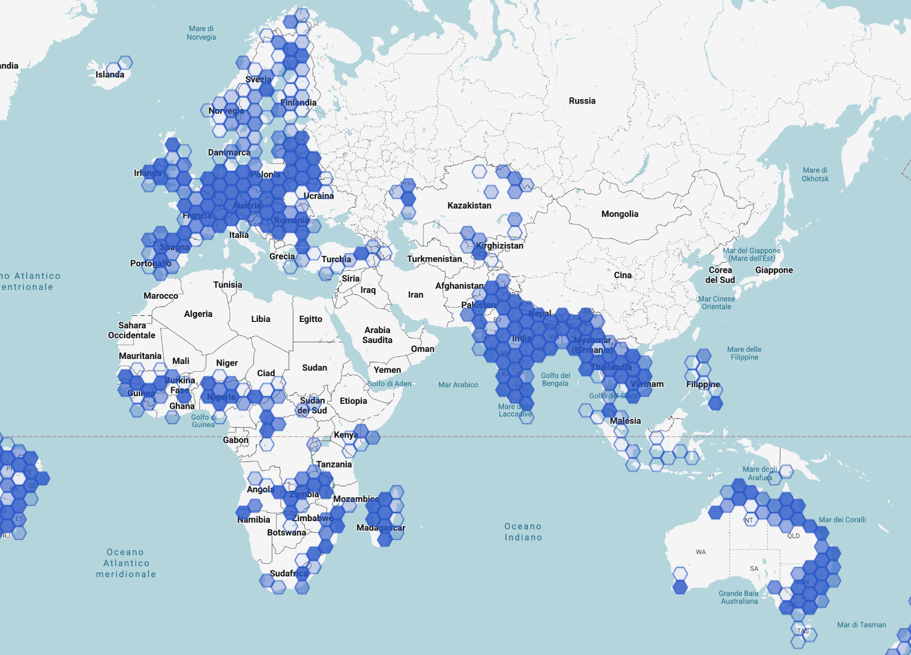
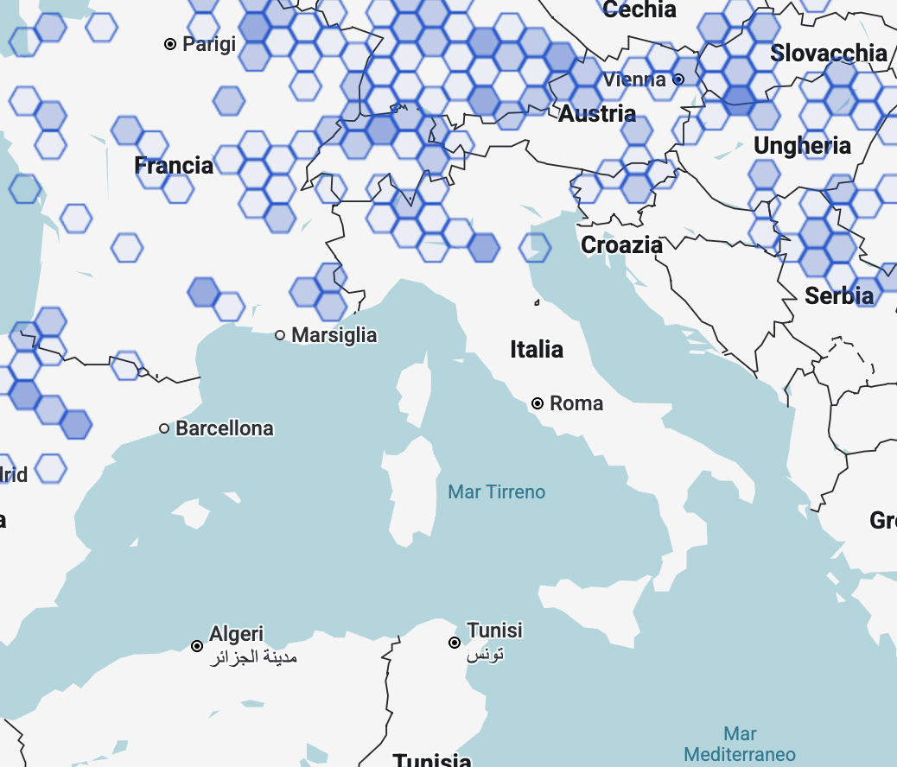
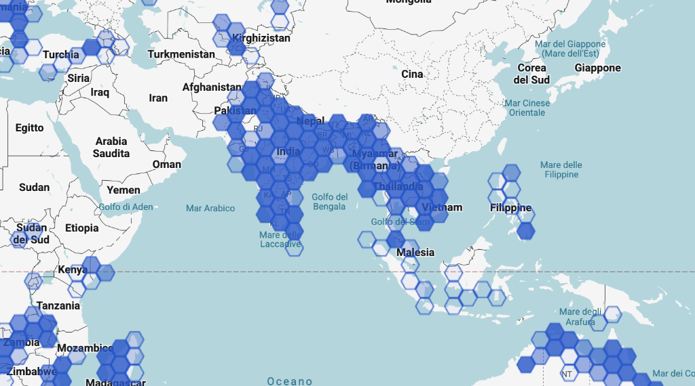
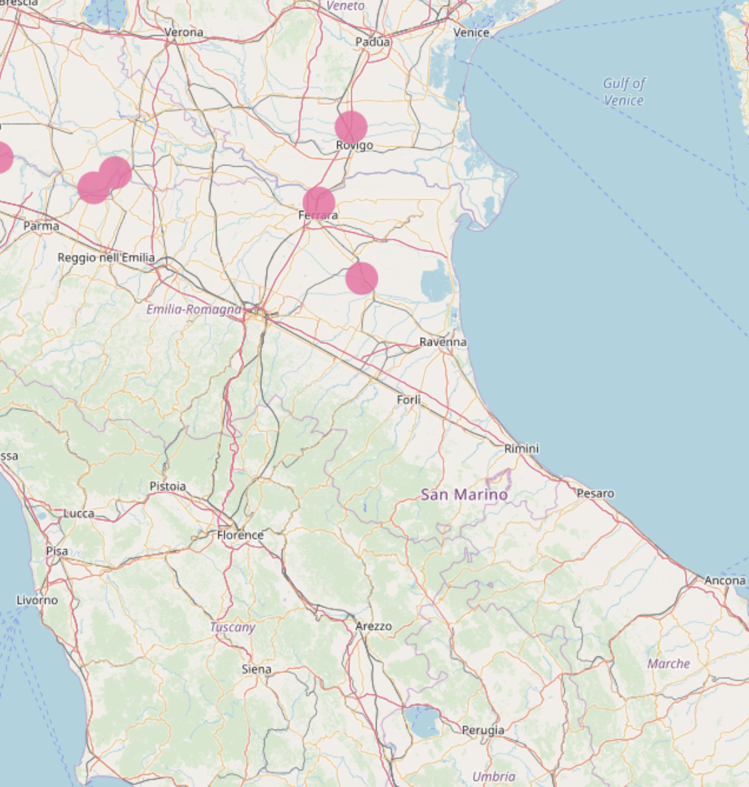

# Floods4castIT

🚧 **REPO IN COSTRUZIONE** 🚧

### Previsione delle piene e quantificazione dell’incertezza
Avvio su Emilia-Romagna, con successiva valutazione di estensione alla Toscana.

Proposta progettuale in fase di impostazione e valutazione. Nessun modello è ancora
implementato. Il documento descrive il flusso logico proposto, tuttora in valutazione,
e le scelte metodologiche di dettaglio sono parte del lavoro di tesi e non ancora
definite. 

Floods4CastIT è il progetto di tesi magistrale sulla previsione delle piene fluviali e dell’estensione delle inondazioni. Il lavoro è diviso in due parti: prevedere il livello idrometrico e stimare l’area potenzialmente allagata nelle zone prossime agli idrometri.

Il filo conduttore è la quantificazione dell’incertezza tramite *Conformal Prediction*: l’obiettivo non è ottenere soltanto una previsione puntuale, ma valutarne l’affidabilità, soprattutto durante gli eventi di piena.

Il caso di studio iniziale riguarda i bacini del Senio, Lamone, Montone e Ronco, in Emilia-Romagna. È in corso l’acquisizione di dati della Toscana e di ulteriori idrometri dell’Emilia-Romagna, per estendere lo studio in base alla disponibilità dei dati e alle verifiche di trasferibilità.

## Parte 1 — Previsione idrometrica

La prima parte riguarda la previsione del livello di un corso d’acqua a un determinato orizzonte temporale, utilizzando le serie storiche degli idrometri e le informazioni sulle stazioni e sulle loro posizioni lungo la rete fluviale.

È inoltre da valutare la possibilità di stimare il livello in punti sprovvisti di idrometro, introducendo degli “idrometri virtuali” lungo il fiume. La fattibilità di questa estensione dipenderà dai dati disponibili, dalle informazioni morfologiche e dalle caratteristiche dei corsi d’acqua analizzati.

Lo studio si concentra sulla previsione a *x* step temporali in avanti, considerando il livello idrometrico sia nel riferimento della stazione sia in relazione alle soglie ufficiali definite da ARPA. Alla previsione viene affiancata la quantificazione dell’incertezza, per valutare un primo trigger di allarme e, soprattutto, l’attivazione della seconda fase: la previsione dell’estensione della potenziale inondazione.

Il confronto comprende modelli di riferimento: persistenza e regressioni classiche, modelli più complessi come CatBoost, MLP, KAN e LSTM. 
Ogni modello viene valutato separatamente e accompagnato da una calibrazione conformal. La scelta finale dipenderà dai risultati, senza assumere in partenza la superiorità di una specifica architettura.

Gli output previsti sono:
- Previsione del livello idrometrico nel riferimento della stazione e rispetto alle soglie.
- Intervalli predittivi conformal.
- Valutazione dei superamenti delle soglie e del comportamento durante le piene.
- Definizione di un possibile trigger per l’attivazione della seconda fase.

## Parte 2 — Previsione dell’inondazione

La seconda parte riguarda la previsione dell’estensione dell’inondazione intorno agli idrometri e, se l’estensione della prima fase risulterà fattibile, anche intorno a punti di interesse non strumentati. Le previsioni idrometriche vengono integrate con dati topografici e osservazioni satellitari SAR disponibili prima dell’emissione della previsione.

L’obiettivo è prevedere la zona potenzialmente allagata a *y* step temporali dopo il trigger della prima fase, descrivendola attraverso una mappa e una stima della superficie coinvolta.

I dati satellitari servono sia a descrivere lo stato precedente sia a costruire il riferimento con cui valutare le previsioni future. Segmentare un’immagine acquisita durante una piena e prevedere l’allagamento prima di quell’acquisizione restano quindi due compiti distinti.

L’analisi non si limita agli eventi oltre la soglia rossa: saranno potenzialmente considerate anche le condizioni del territorio nelle fasi intermedie, comprese quelle tra la soglia arancione e quella rossa, per valutare il comportamento del sistema prima delle situazioni più critiche.

Anche in questa fase è previsto un confronto tra modelli. Per la superficie allagata verranno valutati modelli di regressione; per le mappe, il punto di partenza sarà il confronto tra la persistenza dell’ultima osservazione e una CNN (da valutare), eventualmente di tipo U-Net. L’impiego di una ConvLSTM sarà valutato in base alla disponibilità di sequenze satellitari e di un numero sufficiente di eventi indipendenti. Le scelte modellistiche sono ancora in fase di valutazione.

La quantificazione dell’incertezza prevede:
- Intervalli conformal per la superficie allagata.
- Possibile impiego di *Conformal Risk Control* per le mappe, definendo il rischio da controllare e prestando particolare attenzione alle aree allagate non rilevate. Questa impostazione è ancora da valutare.

## Metodo e valutazione

La configurazione principale non utilizza precipitazioni osservate, previsioni meteorologiche, rianalisi o simulazioni idrauliche. Ogni previsione deve impiegare esclusivamente informazioni effettivamente disponibili al momento della sua emissione.

La valutazione prevede:
- Separazione cronologica tra addestramento, validazione, calibrazione e test.
- Trattamento dei dati mancanti senza utilizzare osservazioni future, valutando anche procedure di preprocessing senza imputazione.
- Confronto dei modelli sugli stessi target e sulle stesse partizioni.
- Analisi dell’errore predittivo, della copertura e dell’ampiezza degli intervalli.
- Verifiche dedicate agli eventi di piena e, quando possibile, a stazioni o bacini esclusi dall’addestramento.

La seconda fase utilizza previsioni idrometriche fuori campione e viene calibrata direttamente sui propri output finali. L’affidabilità viene quindi valutata anche sul risultato della catena completa, non soltanto sulle singole componenti.

## Stato del progetto

Il progetto è in sviluppo. I modelli descritti sono candidati sperimentali, non soluzioni già selezionate. La stima nei punti non strumentati, le modalità di attivazione della seconda fase e le architetture per la previsione spaziale sono ancora oggetto di valutazione.

La repository raccoglie il lavoro necessario a costruire e valutare una pipeline riproducibile. I risultati preliminari verranno aggiunti indicando dati utilizzati, orizzonti di previsione, configurazioni sperimentali e limiti osservati.
________________________________________________________________________________________________________________________________________

[OLD NOTES]
## 9. Confronti e valutazioni

### 9.1 Nearing et al. (2024) [Google Flood Hub]
**Global prediction of extreme floods in ungauged watersheds.**

https://www.nature.com/articles/s41586-024-07145-1

LSTM encoder–decoder su 5.680 idrometri, **passo giornaliero** (non minuti o ore), orizzonte 7 giorni, senza alcun dato
osservato di portata in ingresso. La valutazione è per eventi, su soglie definite da tempo di
ritorno, e il risultato principale è che a 5 giorni di anticipo l'affidabilità paragonabile al nowcast di
GloFAS.

È il regime diverso da quello del progetto proposto. A seguire alciuni punti sostanziali:

- il passo è **giornaliero**, non a minuti o ore: la dinamica dei bacini che rispondono in poche ore
  è filtrata via per costruzione;
- la variabile prevista è la **portata**, mentre le **soglie** di criticità italiane
  sono definite sul **livello idrometrico** ufficiali;
- le soglie sembrano derivare da **tempi di ritorno ricalcolati sulla serie simulata di ciascun modello e su valori osservati**
  non valori assoluti pubblicati come nella proposta progettuale dove si fa riferimento a livelli idrometrici ufficiali.
- il modello produce una **distribuzione predittiva** a ogni passo ed i risultati riportano solo
  la mediana 
- sul territorio italiano la copertura è **marginale** e concentrata pochi punti d'interesse (dettaglio nelle immagini).
 
 

**Nel lavoro proposto:** un modulo veloce su livelli idrometrici con inerzie di
15/30 minuti e/o ore proprie del regime strumentato; a valle, una stima dell'area presumibilmente interessata dall'acqua, ricavata dal
profilo di livello previsto e da acquisizioni satellitari, che non entra come input
a monte ma traduce la previsione idrometrica in informazione territoriale. 
Non unicamente previsione da satellite, ma sfruttare l'informazione satellitare che porta la dimensione spaziale. 
In aggiunta: quantificazione dell'incertezza e confronto sistematico tra modelli alternativi.

#### Copertura di Flood Hub sul territorio italiano
(Nota importante, dati ad oggi)

Il portale dichiara oggi una copertura globale dell'ordine di 150 paesi e oltre 240.000 località.
La copertura non è però uniforme in qualità: Google distingue le località **verificate**, dove è
stata possibile una valutazione della qualità del modello contro osservazioni storiche o immagini
satellitari, dalle altre e le prime sono circa 5.000. **Copertura non implica validazione.**

Ad oggi, la copertura in Italia risulta bassa.

Le immagini seguenti documentano la situazione osservata sul territorio italiano ad agosto 2026.

<!-- Immagine 1: vista d'insieme del territorio nazionale -->

*Fig. A — Copertura Flood Hub sul territorio nazionale, fonte
[g.co/floodhub](https://g.co/floodhub).*
____________________________________________________________________________________________________________________________________
<!-- Immagine 2: dettaglio sull'area di interesse del progetto -->

*Fig. B — Dettaglio sull'area di interesse del progetto (EmiliaRomagna - Toscana].* ,fonte
[g.co/floodhub](https://g.co/floodhub).*
____________________________________________________________________________________________________________________________________
<!-- Immagine 3: confronto con paesi con alta copertura (es. India) -->

*Fig. C — Confronto con paesi con alta copertura (es. India), fonte
[g.co/floodhub](https://g.co/floodhub).*
____________________________________________________________________________________________________________________________________
<!-- Immagine 4: focus italia anche per GloFAS  -->

*Fig. D — Confronto anch su copertura da GIoFAS* , fonte
[GloFAS](https://global-flood.emergency.copernicus.eu/map)

____________________________________________________________________________________________________________________________________

**Nota sulla natura di questa verifica.** La copertura di Flood Hub cambia nel tempo e le immagini fanno riferimento a quanto disponibile ad agosto 2026.
Il posizionamento del progetto **non dipende da questa verifica** rimane un modo diverso e potenzialmente valutabile per allarmi di natura alluvionale con particolare focus sull'Italia e sui bacini che sono sempre più importanti per territori e gestori di infrastrutture per avere sistemi nuovi e che sfruttino dati e informazioni sempre più nuovi ed aggiornati.

____________________________________________________________________________________________________________________________________
____________________________________________________________________________________________________________________________________
____________________________________________________________________________________________________________________________________

### 9.2 Roudbari et al. (2024)

**From data to action in flood forecasting leveraging graph neural networks and digital twin visualization.**

https://www.nature.com/articles/s41598-024-68857-y

Lo studio propone un duplice framework: un modello previsionale e uno strumento di visualizzazione.
Sul lato previsionale una GNN, con architettura encoder–decoder basata su blocchi GCRN (Graph
Convolution Recurrent Network) con approccio **graph learning**: la matrice di
connettività fra le stazioni non è imposta a priori dalla topologia fluviale ma **appresa dai dati**,
scelta motivata dal fatto che la struttura reale della rete può essere ignota o mutare nel tempo.

La variabile prevista è il **livello idrometrico**, a **passo giornaliero**, con orizzonti di 3, 6 e
9 **giorni**, su 8 stazioni nell'area di Terrebonne (Montreal) con serie 2000–2021 da
Environment and Climate Change Canada.

Nel modello predittivo non sono utilizzati dati di precipitazione: gli input sono i
soli livelli delle 8 stazioni. Suddivisione temporale 70/10/20. La valutazione usa MAE, MAPE e RMSE,
confrontando con la media storica e con quattro modelli di previsione spaziotemporale (Informer,
GTS, DCGCN, STAWnet) sviluppati in altri contesti, in particolare per la previsione del traffico.

Sul lato visualizzazione, gli autori costruiscono un gemello digitale della città in ambiente di
game engine per ulteriori simulazioni (fuori contesto rispetto alla proposta progettuale)

A seguire alciuni punti sostanziali rispetto alla proposta progettuale:

- Regime temporale: passo giornaliero e orizzonti di 3–9 giorni: è la scala della
   pianificazione, non quella dell'allertamento su bacini a risposta rapida. La proposta
   progettuale lavora a inerzie di 15/30 minuti e ore, dove l'orizzonte utile si misura in ore.

- Trattamento delle anomalie: i valori mancanti sono ricostruiti con la media storica e la
   serie è poi sottoposta a **smoothing gaussiano**, descritto dagli autori come mezzo per attenuare
   le fluttuazioni improvvise senza compromettere i pattern sottostanti. Su un problema di previsione
   di piene, tuttavia, la fluttuazione improvvisa **è** il segnale di interesse. Nella proposta
   progettuale il filtraggio è limitato al rumore strumentale documentato e verificato sugli eventi,
   e gli eventi maggiori sono oggetto di validazione dedicata anziché di attenuazione. Una parte
   sostanziale del lavoro della proposta progettuale dovrà esser dedicata proprio al preprocessing e alla data quality: definizione
   delle regole e delle metodologie per il trattamento dei dati mancanti e delle misure provenienti
   da strumentazione con potenziali malfunzionamenti.

- Oggetto della valutazione: le metriche riportate sono MAE, MAPE e RMSE aggregate sull'intera
   serie di test, senza alcun riferimento a soglie. Nella proposta progettuale anche il **superamento
   della soglia di criticità ufficiale è oggetto della valutazione**, insieme al tempo di anticipo
   effettivamente disponibile.

- Baseline di confronto: i termini di paragone sono la media storica e quattro modelli nati per
   la previsione del traffico.
Nella proposta progettuale, oltre a vari modelli da comparare, aggiungendo eventualmente GNN, tra i benckmark di prevederebbe anche una valutazione vs un modello semplificato che analizza unicamente una singola stazione di rilevamento.

- Quantificazione dell'incertezza: è assente, il modello produce una previsione puntuale e la
   valutazione è deterministica. La proposta progettuale introduce una verifica della copertura,
   indipendente dal modello predittivo e quindi applicabile anche ad architetture alternative.

- accoppiamento fra previsione e rappresentazione a valle: nel lavoro di riferimento le due
   componenti restano in larga parte separate, e il confronto con la mappa di allagamento del 2017 è
   **qualitativo**, senza metriche di sovrapposizione. Nella proposta progettuale il legame fra
   componente previsiva e componente territoriale è quantificato, ed è centrale: le due parti
   convergono nell'output finale del sistema.

- Informazione territoriale nella previsione: gli autori indicano fra i lavori futuri
   l'integrazione dell'informazione sulla quota del terreno all'interno della rete previsiva,
   osservando che si tratta di un fattore influente attualmente non considerato. La proposta
   progettuale muove in quella direzione, ma con una caratterizzazione dello **stato dinamico** del
   territorio da acquisizioni satellitari.

**Elementi da valutare per integrarli eventualmente nella proposta progettuale.** L'impiego di una GNN è un elemento da considerare nella proposta
progettuale, insieme alla metodologia di gestione del dato. In particolare, la relazione fra le
stazioni di misura appresa dai dati anziché derivata da una mappatura statica basata su informazioni
anagrafiche della rete è un'opzione da valutare in termini di rapporto costi/benefici.

____________________________________________________________________________________________________________________________________
____________________________________________________________________________________________________________________________________
____________________________________________________________________________________________________________________________________

### 9.3 Nevo et al. (2022) [Google- sistema operativo India/Bangladesh]
**Flood forecasting with machine learning models in an operational framework.**

https://hess.copernicus.org/articles/26/4013/2022/
*(N.d.R. il paper precede di due anni Nearing et al. 2024)*

Studioa e allertamento in due parti, Stage forecast model e inundation model. A seguire focus sulla parte di Stage forecast model che è quello d'interesse da valutare.

La previsione è affidata a una rete LSTM. La variabile
prevista è il **livello idrometrico**. Passo orario, orizzonte 8–48 h, 167 idrometri su bacini da
350 a 1.500.000 km² in India e Bangladesh. Fra gli input, oltre ai livelli osservati alla
sezione obiettivo e a monte, anche la precipitazione stimata da dati satellitari.

L'incertezza è modellata direttamente dalla rete con una CMAL (Countable Mixture of Asymmetric
Laplacians): a ogni passo il modello produce i parametri di una insieme di distribuzioni anziché un
singolo valore, viene poi mostrata la fascia fra il 20° e l'80° percentile. L'allarme
scatta quando il massimo del livello previsto sull'intera finestra supera la soglia di allerta
predefinita per quella sezione, fornita dalle autorità nazionali. La valutazione è riportata in
termini di NSE (Nash–Sutcliffe Efficiency) e la vairante Persistent-NSE non con metriche le metriche per valutazione se superamento intercettato o no

A seguire alciuni punti sostanziali rispetto alla proposta progettuale:

- Regime dei bacini: lo studio è progettato per fiumi grandi a risposta lenta,
   e gli autori indicano l'estensione ai bacini sotto i 1.000 km² come sviluppo futuro. Le metriche
   riportate crescono infatti con l'area del bacino. La proposta progettuale lavora su bacini più
   ridotti (caso italiano), a inerzie di 15/30 minuti e/o ore.

- Oggetto della valutazione: lo studio fa parla di un sistema di riferimento che decide in modo binario (allarme o non allarme) rispetto a una soglia, ma viene valutato con NSE e Persistent-NSE. Nella proposta progettuale il **superamento della soglia di criticità è
   l'oggetto stesso della valutazione**, insieme al tempo di anticipo effettivamente disponibile;
   altre metriche saranno definite in base alle valutazioni preliminari.

- Verifica dell'incertezza: la distribuzione predittiva è prodotta e usata, ma la valutazione
   riportata resta su metriche di errore. La proposta progettuale introduce una **verifica della
   copertura**: controllare che la frequenza con cui i valori osservati cadono dentro l'intervallo
   previsto corrisponda al livello dichiarato, e che ciò valga anche separatamente in piena e non
   solo in aggregato. La verifica è indipendente dal modello predittivo, quindi applicabile a
   qualsiasi altro modello, e il livello di confidenza è impostabile in funzione dell'uso.

- Comportamento oltre il record storico: quando l'ampiezza dell'incertezza stimata supera una
   soglia, fissata a 50 cm nel paper, il sistema di riferimento accorcia il lead time fino a
   rientrare sotto quel valore. Nella proposta progettuale la selezione dell'orizzonte è ricondotta
   a un criterio di **copertura verificata** anziché di ampiezza.

- Orizzonte come grandezza derivata: il lead time massimo è, nel paper, un parametro di
   configurazione definito a priori per ciascuna stazione. Su bacini a risposta rapida l'orizzonte
   determina l'utilità stessa del sistema: nella proposta progettuale viene **derivato** dal tempo
   di risposta del bacino e dal punto oltre il quale la copertura non è più verificata.

- Contesto di valutazione: gli autori segnalano in più punti la scarsità di studi di
   valutazione di sistemi operativi e, nel confronto con la letteratura, reperiscono un solo
   termine di paragone (51 idrometri in Iowa) riconoscendone la limitata comparabilità. Non
   risultano riferimenti operativi in area europea o mediterranea.

____________________________________________________________________________________________________________________________________
____________________________________________________________________________________________________________________________________
____________________________________________________________________________________________________________________________________

### 9.4 Oddo et al. (2024)

**Deep Convolutional LSTM for improved flash flood prediction.**

<https://doi.org/10.3389/frwa.2024.1346104>

Lo studio valuta se l'aggiunta di informazione **spaziale** migliori la previsione idrometrica su un
bacino a risposta molto rapida. Il caso è il Tiber-Hudson di Ellicott City, colpito da due eventi
classificati come millenari nel 2016 e nel 2018.

La variabile prevista è il **livello idrometrico**, a passo **orario**, con 42.384 osservazioni fra
gennaio 2016 e ottobre 2020. Il baseline è una LSTM alimentata dai livelli di due sole stazioni. A
questa viene affiancata una ConvLSTM. Gli input spaziali sono quattro, su griglia 36×48 km a
risoluzione 1 km per NEXRAD, umidità del suolo dal modello Noah, precipitazione
satellitare IMERG, precipitazione accumulata, combinati isolando il contributo
marginale di ciascuno.

Il risultato principale è un miglioramento del ~26% dell'RMSE sugli istanti di piena rispetto al
baseline.

Rispetto agli altri riferimenti, questo lavoro **converge** con la proposta progettuale su alcune
scelte e ne fornisce evidenza sperimentale.

A seguire alciuni punti sostanziali rispetto alla proposta progettuale:

- La risoluzione dei prodotti satellitari ha importanza: ad esempio IMERG e Noah, usati
individualmente, producono gli errori più alti, gli autori attribuiscono il risultato alla loro risoluzione (11–12 km)
rispetto al chilometro dei prodotti da NEXRAD. È un'indicazione sperimentale contro l'inserimento del
dato satellitare a bassa risoluzione come input a monte, utile nelle valutazioni dei dati satellitari eventualmente da utilizzare nella proposta progettuale.

- il vincolo alla granularità temporale è il satellite: gli autori osservano che dati idrometrici
sub-orari sarebbero disponibili, ma che il fattore limitante è la frequenza delle osservazioni
satellitari. È il principio alla base della proposta progettuale a due fasi: la scala veloce resta a
terra, il satellite descrive lo sfondo su un'inerzia diversa.

- la direzione futura indicata è la Fase 2: fra gli sviluppi gli autori indicano l'aggiunta di
caratteristiche, come la copertura del suolo, da aggiungere alla metodologia.

- orizzonte: la previsione è a **t+1 ora**, un solo passo. La proposta progettuale ha come obiettivo anche la valutare la
degradazione lungo l'orizzonte temporale previsionale, nella proposta si parla di previsione multi orizzonte che è comunque oggettodi misura.

- estensione della rete: lo studio utilizza due sole stazioni idrometriche su un singolo bacino.
La proposta progettuale prevede di lavorare sulla rete regionale, con un numero di sezioni (quasi 300 stazioni solo in Emilia romagna e oltre 30 bacini)) e una
profondità storica di 15/20 anni (almeno)

- Soglia surrogata invece che ufficiale: l'ente locale dispone di soglie operative dichiarate, ma
la valutazione usa una soglia ricavata statisticamente dai picchi della serie, situata circa 30 cm (1 foot)
**sotto** la prima soglia ufficiale, che identifica 164 istanti di piena. Nella proposta progettuale
il riferimento sono le soglie di criticità ufficiali, non un surrogato statistico.

- Distanza fra metrica di errore e metrica di decisione: il miglioramento del 26% sull'RMSE ai
picchi si traduce in un miglioramento del **6%** nella corretta identificazione degli istanti di
piena, e gli autori riportano un elevato tasso di falsi negativi sia per la ConvLSTM sia per il
baseline. Un guadagno sull'errore quadratico non implica quindi un guadagno equivalente sulla
decisione di allertamento: nella proposta progettuale è quest'ultima a essere misurata direttamente.

- eventi estremi nel training: entrambe le piene storiche ricadono nel periodo di addestramento.
Gli autori eseguono una diagnostica separandole e riportano un **incremento del 52% dell'RMSE** sugli
istanti di piena. È una misura esplicita del divario fra prestazioni in campione e fuori campione
sugli estremi. Nella proposta progettuale la distribuzione degli eventi maggiori fra periodo di
addestramento e periodo di test sarà esplicitata, con una validazione dedicata agli eventi che
eccedono il massimo osservato in addestramento (comunque presenti dato l'intervallo storico ed i bacini considerati, alluvioni evento purtroppo ripetitivo in EmiliaROmagna e in Toscana)

- Quantificazione dell'incertezza: assente nel paper: la valutazione è deterministica e basata su
RMSE con test di significatività rispetto al baseline. Nella proposta progettuale è una componente a
sé stante, indipendente dal modello predittivo e quindi applicabile a qualsiasi architettura.te.

**Elementi da valutare per la proposta progettuale.** Un risultato controintuitivo utile in fase di
progettazione: finestre di input **più corte** (1–2 ore) hanno prodotto errori inferiori rispetto a
finestre più lunghe, comportamento che gli autori attribuiscono alla rapidità di risposta del bacino.

### 9.5 Altri riferimenti da approfondire

(Riferimenti da revisionera dettagliatamente, ad oggi valutati in bozza )

- Troung et al. (2026): HIGNN — Hydrological Interpolation based on Graph Neural Network
Advances in Water Resources, 2026
https://www.sciencedirect.com/science/article/pii/S0309170826000576
>(Rete a grafo per stimare il livello in siti non strumentati, con archi che portano
attributi del terreno. Vicino alla Fase 1 (tra io pochi riferimenti con questo tema nella loro analisi).
Da approfondire: interpola al presente anziché prevedere, e non quantifica
l'incertezza)

- Kratzert et al. (2019) :Prediction in Ungauged Basins with Long Short-Term Memory Networkshttps:https:
 https://www.researchgate.net/publication/335415849_Prediction_in_Ungauged_Basins_with_Long_Short-Term_Memory_Networks
>Filone ampio su bacini interi privi di misure. proposta progettuale non un fiume senza punti di rilevazione ma rilevazioni tra punti con stazione presente)

- Tibshirani et al. (2019): Conformal prediction under covariate shift
https://arxiv.org/abs/1904.06019
> Base teorica per il caso in cui la calibrazione avviene su una stazione e la garanzia
> serve su un'altra. *Da verificare quanto sia direttamente applicabile. (da completare)*

- repository completa per lavori su Conformal Prediction: 
 https://github.com/valeman/awesome-conformal-prediction

- repository su valutazione Transformers per timeseries (o meglio perchè non usarli)
https://github.com/valeman/Transformers_And_LLM_Are_What_You_Dont_Need

- Barbetta et al (2017): The multi temporal/multi-model approach to predictive uncertainty assessment in real-time flood forecasting
https://www.researchgate.net/publication/317598233_The_multi_temporalmulti-model_approach_to_predictive_uncertainty_assessment_in_real-time_flood_forecasting
> Stima la probabilità di superamento di soglie idrometriche entro un orizzonte e il
> momento più probabile del superamento (ma con approccio Bayesiano)
inoltre usa la pioggia e non fornisce garanzie di copertura.

- Luppichini et al. (2024): Machine learning models for river flow forecasting in small catchments
https://www.nature.com/articles/s41598-024-78012-2
> Contesto toscano, da studiare e potenzialamente rilevante e con spunti utili per la proposta progettuale

- Gambini et al. (2023): An empirical rainfall threshold approach for the civil protection flood warning system on the Milan urban area
https://www.sciencedirect.com/science/article/pii/S0022169423014555
> Dichiara esplicitamente due limiti: il basso numero di eventi di superamento e la non stazionarietà della risposta di bacino.

- Capo et al. (2026): Monitoring Flood Inundation Dynamics From Space
https://agupubs.onlinelibrary.wiley.com/doi/10.1029/2025RG000885
> Rassegna di riferimento del campo.

- Sharma, Saharia (2026): DeepSARFlood: Rapid and automated SAR-based flood inundation mapping using vision transformer-based deep ensembles with uncertainty estimates
https://www.sciencedirect.com/science/article/pii/S2666017225000094
> Ensemble con stime di incertezza, ed etichette deboli da immagini ottiche concomitanti. Da valutare potenziale utilità per uso dati satellitari.

- Kabir et al. (2020): A deep convolutional neural network model for rapid prediction of fluvial flood inundation
https://www.researchgate.net/publication/342522065_A_deep_convolutional_neural_network_model_for_rapid_prediction_of_fluvial_flood_inundation
> CNN addestrata su input da modello idrodinamico.  (da analizzre meglio su cosa fanno training)

- Fereshtehpour et al. (2025): Impacts of DEM Type and Resolution on Deep Learning-Based Flood Inundation Mapping
https://arxiv.org/abs/2309.13360
> potenziale utilità per la fase due della proposta progettuale.

- Dazzi et al. (2021): Flood Stage Forecasting Using Machine-Learning Methods: A Case Study on the Parma River (Italy)
https://www.mdpi.com/2073-4441/13/12/1612
